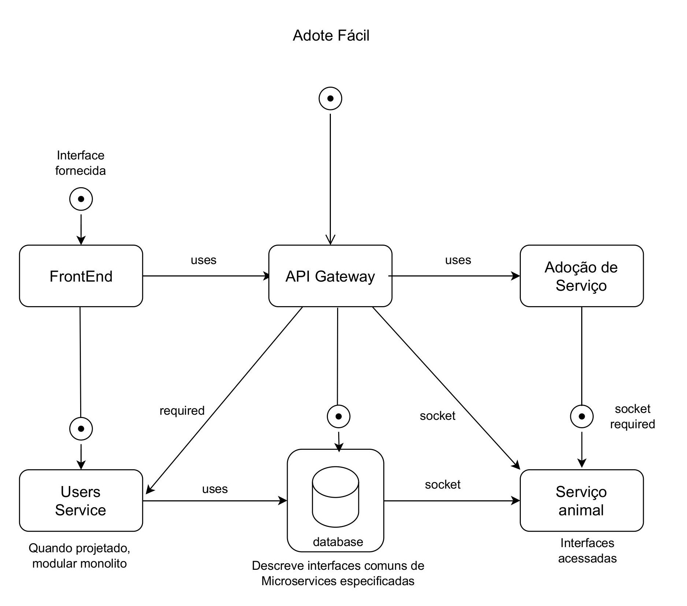

# Arquitetura adotada:
O projeto "Adote Fácil" adota uma arquitetura de Microsserviços/Monolito Modular com Frontend Separado, combinada com uma abordagem de Camadas dentro de cada um dos serviços.

**Microsserviços/Monolito Modular com Frontend Separado:**

    O sistema é dividido em duas grandes partes principais: frontend e backend.

    O frontend é uma aplicação Next.js que roda em uma porta separada (3000) e se comunica com o backend através de chamadas de API.
    O backend é uma aplicação Node.js/Express que roda em outra porta (8080) e lida com a lógica de negócio, persistência de dados e autenticação.

    Justificativa: Essa separação permite que o desenvolvimento do frontend e do backend ocorra de forma independente. Cada parte pode ser escalada, implantada e mantida separadamente, o que aumenta a flexibilidade e a resiliência do sistema. Além disso, a utilização do Next.js no frontend oferece benefícios como Server-Side Rendering (SSR) e otimizações de performance, enquanto o Node.js no backend é eficiente para operações de I/O, ideal para uma API RESTful.

**Arquitetura em Camadas (dentro do Backend):**

    Dentro do serviço de backend, é possível identificar uma estrutura em camadas que segrega as responsabilidades:

    Controllers: Lidam com as requisições HTTP, validam os dados de entrada e chamam os serviços apropriados. Exemplos incluem CreateUserController, CreateAnimalController, GetUserChatsController. 
    Services: Contêm a lógica de negócio principal da aplicação. Eles orquestram as operações, interagem com os repositórios e aplicam as regras de negócio. Exemplos: CreateUserService, CreateAnimalService, UpdateAnimalStatusService, GetUserChatsService.
    Repositories: São responsáveis pela interação com o banco de dados (Prisma Client). Eles abstraem a lógica de persistência, como a criação, atualização e busca de dados. Exemplos: UserRepository, AnimalRepository, AnimalImageRepository, ChatRepository, UserMessageRepository. 
    Providers: Oferecem funcionalidades específicas, como autenticação (Authenticator) e criptografia (Encrypter). 
    Middlewares: Interceptam requisições HTTP para realizar validações (ex: UserAuthMiddleware para autenticação) antes que a requisição chegue aos controllers. 

    
    Justificativa: A arquitetura em camadas promove a separação de preocupações (Separation of Concerns), tornando o código mais organizado, manutenível e testável. Cada camada tem uma responsabilidade bem definida, o que facilita a colaboração entre desenvolvedores e a evolução do sistema. Por exemplo, a lógica de negócio pode ser alterada nos serviços sem afetar os controllers ou os repositórios, desde que as interfaces sejam mantidas
# *Diagrama:*  

